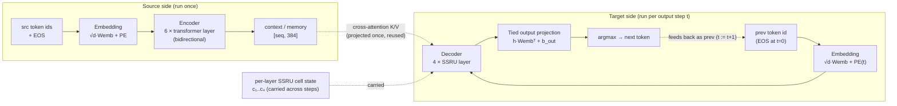
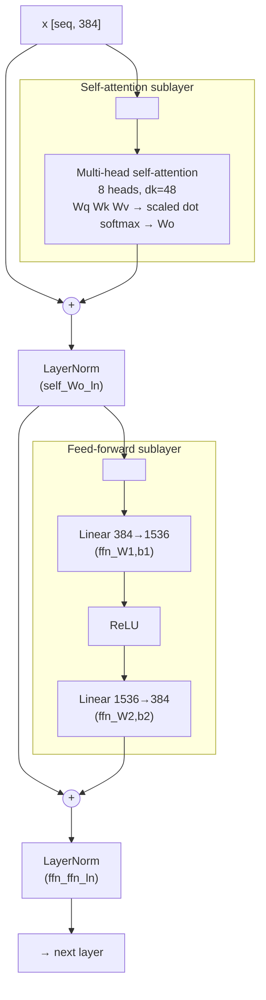
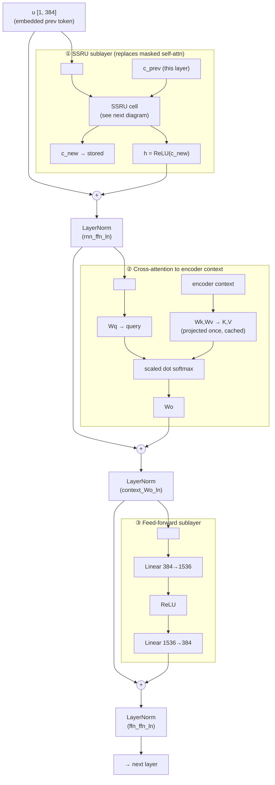
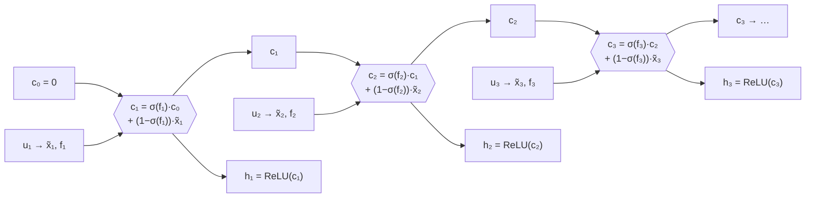
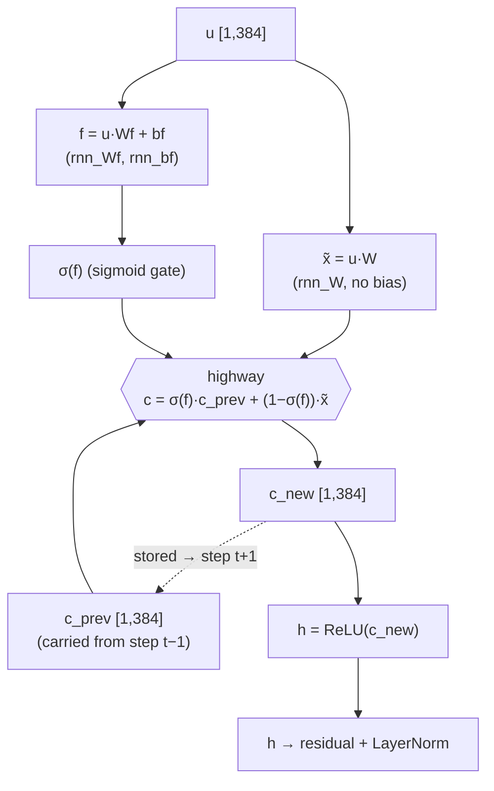
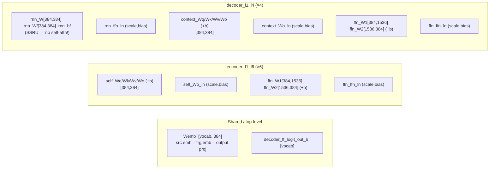

# fxtranslate model architecture

This document describes the exact model that `fxtranslate` runs — the "tiny"
student translation model shipped by Firefox Translations / Bergamot. It is a
Transformer in the [Vaswani et al. 2017] sense on the **encoder** side, but the
**decoder** is *not* a standard Transformer decoder: its self-attention sublayer
is replaced by an **SSRU** (Simpler Simple Recurrent Unit) recurrent cell. That
substitution is what makes autoregressive decoding cheap (no growing KV cache,
no per-step attention over generated tokens) and it is the single most important
thing to understand about this architecture.

Everything below is grounded in the Rust engine
(`crates/fxtranslate/src/engine.rs`, `weights.rs`, `ops.rs`), the tensor shapes
in the real `en→fr` model, and the marian reference
(`marian-dev/src/rnn/cells.h`).

[Vaswani et al. 2017]: https://arxiv.org/abs/1706.03762

---

## The config lies (and how)

The embedded `special:model.yml` is written by marian's generic training
harness, so it advertises knobs for architectures this exported student does
**not** use. Reading it literally is misleading. The actual dimensions come from
the tensor shapes in the file, not the yaml. Confirmed discrepancies:

| `model.yml` says | Reality in the shipped model | Why it's misleading |
| --- | --- | --- |
| `type: transformer` | Transformer **encoder** + **SSRU** decoder | Only the encoder is a vanilla transformer; see `transformer-decoder-autoreg: rnn` and `dec-cell: ssru` two lines down. |
| `dim-rnn: 1024` | SSRU `rnn_W` / `rnn_Wf` are `[384, 384]` | **Vestigial.** SSRU forces `dimInput == dimState == dim-emb` (`cells.h:1001`), so `dim-rnn` is ignored entirely. |
| `transformer-aan-*`, `transformer-dim-aan: 2048` | unused | AAN (Average Attention Network) is an *alternative* autoregressive cell. Dead config because `dec-cell: ssru`. |
| `transformer-decoder-dim-ffn: 0`, `transformer-decoder-ffn-depth: 0` | decoder FFN is `[384, 1536]`, depth 2 | `0` is a sentinel meaning "inherit the encoder FFN settings" (`dim-ffn: 1536`, `ffn-depth: 2`). |
| `dec-cell-base-depth: 2`, `dec-cell-high-depth: 1` | one SSRU cell: one `W`, one `Wf`+`bf` | SRU-family stacking knobs; the exported cell is a single SSRU, not a stack. |
| `tied-embeddings: false`, `tied-embeddings-src: false` | one `Wemb` for source, target, **and** output projection | `tied-embeddings-all: true` overrides both — the "-all" flag wins. |
| `dim-vocabs:` (empty list) | 32000-ish, read from the `Wemb` row count | The engine ignores the yaml here and counts embedding rows (`weights.rs`). |
| `transformer-preprocess: ""`, `transformer-postprocess: dan` | **post-norm** everywhere | `dan` = dropout→add→norm *after* each sublayer. This is the original Vaswani placement, **not** the pre-norm most modern code uses. |
| `transformer-postprocess-emb: d` | embeddings get dropout only (no LayerNorm) | So after `√d·Wemb + PE` the vector goes straight into layer 1. |

The dimensions that *are* real (and that the engine actually parses from the
yaml, with tensor-shape fallbacks) for the `en→fr` model:

| Symbol | Value | yaml key |
| --- | --- | --- |
| `dim_emb` (d) | 384 | `dim-emb` |
| `heads` (h) | 8 (so `dk = d/h = 48`) | `transformer-heads` |
| `enc_depth` | 6 | `enc-depth` |
| `dec_depth` | 4 | `dec-depth` |
| `dim_ffn` | 1536 | `transformer-dim-ffn` |
| `vocab` | ~32k | `Wemb` rows |

---

## Top-level dataflow

The encoder runs **once** over the whole source sentence. The decoder runs
**once per output token**, autoregressively, until it emits EOS. The encoder
output ("context" / "memory") is fixed for the whole decode; the decoder's
cross-attention K/V are projected from it once and reused across every step
(`Engine::cross_attn_kv`).



Greedy loop (`Engine::greedy`): seed the decoder with EOS, run one
`decode_step` per position updating the four cell-state vectors, argmax the
projection, stop at EOS or the length cap `min(2·srclen + 4, 256)`.

---

## Encoder layer (standard Transformer)

Six identical layers. This is textbook Vaswani, with two things worth flagging
against the classic diagram: it is **post-norm** (LayerNorm sits *after* the
residual add, not before the sublayer), and self-attention is **bidirectional**
(`enc-type: bidirectional`) — no causal mask, every position sees every other.



Params per encoder layer (`encoder_lN_*`): `self_{Wq,Wk,Wv,Wo}` + biases,
`self_Wo_ln_{scale,bias}`, `ffn_{W1,b1,W2,b2}`, `ffn_ffn_ln_{scale,bias}`. Code:
`Engine::encoder_layer` → `multihead` + `ffn`, both closed by `postnorm`.

---

## Decoder layer (SSRU — the interesting part)

Four identical layers. Compared to a Transformer decoder layer, the **masked
self-attention sublayer is replaced by an SSRU cell**. Cross-attention and FFN
are unchanged. There are **no `self_*` tensors in the decoder at all** — the
SSRU (`rnn_*`) is the entire mechanism for mixing information across time.



Params per decoder layer (`decoder_lN_*`): `rnn_W`, `rnn_Wf`, `rnn_bf`,
`rnn_ffn_ln_{scale,bias}` (the SSRU), then `context_{Wq,Wk,Wv,Wo}` + biases and
`context_Wo_ln_{scale,bias}` (cross-attention), then `ffn_{W1,b1,W2,b2}` +
`ffn_ffn_ln_{scale,bias}`. Code: `Engine::decode_step`.

> Naming gotcha: the LayerNorm closing the **SSRU** sublayer is stored as
> `rnn_ffn_ln_*`, and the one closing the **FFN** sublayer as `ffn_ffn_ln_*`.
> The doubled `ffn_ffn` is just marian's sublayer-prefix + postprocess-name; it
> is *not* a second FFN.

### What an SSRU is, conceptually

Strip away the names and an SSRU is a **gated exponential moving average with a
ReLU on top** — a leaky accumulator. That is the whole idea. The recurrence

```text
c_t = keep · c_{t-1} + (1 − keep) · x̃_t         (keep = σ(f_t))
```

is an EMA: each channel of the 384-dim state `c` is a running, decaying summary
of everything the decoder has produced so far. `x̃_t` is the new evidence from
the current token and `keep ∈ (0,1)` is a **learned, per-channel, input-dependent
decay** — how much of the old summary to carry vs. how much to overwrite:

- `keep ≈ 1` → coast on the accumulated history, largely ignore this token.
- `keep ≈ 0` → reset the channel toward the current token's candidate.

Some channels can hold long memory (slow decay) while others react instantly —
all learned. The recurrence is **strictly elementwise**: no channel talks to
another inside the loop. All cross-channel mixing lives in the two matmuls that
produce `x̃ = u·W` and `f = u·Wf + bf`; the recurrent part is just a cheap
384-wide EMA carried across steps.



*The one 384-vector `c` (per layer) is the entire cross-time state, carried
step→step as a running summary. There is no re-reading of past tokens.*

**Why it replaces decoder self-attention.** A normal Transformer decoder uses
masked self-attention so each position looks back over the *entire* history of
generated tokens with content-based weights — O(t) work at step t, plus a KV
cache that grows every token. The SSRU throws that out and keeps a **fixed-size
running summary** instead: one 384-float vector per layer, so 4 layers ≈ **1536
floats of state, constant forever** (vs. attention caching K/V for all prior
positions per layer). That makes each decode step **O(1) with no growing cache**
— the whole point of a student model that decodes token-by-token on a browser
CPU. The trade-off is real: an SSRU genuinely *cannot* do arbitrary
content-based lookups into its own output history the way attention can; it only
has the decaying summary. The model can afford that because the heavy bidirectional
attention over the source already ran once in the encoder, and cross-attention
re-reads that source every step anyway — the decoder self-path mostly just needs
to track "what have I said so far."

**Why "Simpler Simple".** The family is LSTM → GRU → SRU → SSRU, each dropping
machinery. The SRU (Simple Recurrent Unit) keeps a reset gate and *peephole*
connections (its gates read the previous state `c_{t-1}`). The SSRU drops the
reset gate, drops the peephole, and outputs a plain `ReLU(c_t)`. The key
consequence is visible in the formula above: the gate `f = u·Wf + bf` depends
**only on the current input, never on `c_{t-1}`**. That decouples the gate from
the recurrence — during *training* every step's gate is computed in parallel
across the whole sequence, and only the cheap elementwise EMA is truly
sequential — so it trains nearly as fast as a feed-forward layer while still
being a real recurrence at inference.

In one line: **an SSRU is the minimal recurrent cell — one input-dependent
forget gate driving a per-channel EMA, output through ReLU — swapped in for
decoder self-attention to make autoregressive decoding constant-time.**

### The SSRU cell

This is where the recurrence lives. For step input `u` (the embedded previous
token, `[1, 384]`) and the layer's carried cell state `c_prev`:

```text
x̃ = u · W                     # candidate (bias-less; rnn_W)
f  = u · Wf + bf              # forget gate pre-activation (rnn_Wf, rnn_bf)
c  = σ(f) · c_prev + (1−σ(f)) · x̃     # highway blend  →  new cell state
h  = ReLU(c)                  # cell output
```



Why this is cheap: the only cross-time state is one 384-vector `c_prev` per
layer. There is no attention over previously generated tokens and therefore **no
growing KV cache on the decoder self path** — each step is constant work
regardless of how much has been generated. `σ(f)` is the forget gate: near 1 it
carries the old cell state forward (remember), near 0 it overwrites with the new
candidate `x̃`.

Grounding — marian `SSRU::applyInput` / `applyState` (`cells.h:1029–1066`):

```cpp
x = dot(inputDropped, W_);          // x̃  (candidate)
f = affine(inputDropped, Wf_, bf_); // forget gate
auto nextCellState = highway(cellState, x, f);  // σ(f)·cellState + (1−σ(f))·x
auto nextState     = relu(nextCellState);
```

and the Rust engine (`engine.rs`, `decode_step`):

```rust
let cand = self.weights.affine("…_rnn_W",  &x, 1, None);              // x̃
let gate = self.weights.affine("…_rnn_Wf", &x, 1, Some("…_rnn_bf"));  // f
let c = ops::highway(&cells[layer], &cand, &gate);                    // c
cells[layer] = c.clone();
let h = ops::relu(&c);
```

`ops::highway(a, b, t) = σ(t)·a + (1−σ(t))·b`, so `a = c_prev`, `b = x̃`,
`t = f` — matching marian bit-for-bit.

---

## Embeddings and positional encoding

One tensor, `Wemb`, is shared three ways (`tied-embeddings-all: true`): source
embedding, target embedding, and the output projection weight. (Split-vocab CJK
models instead ship `encoder_Wemb` + `decoder_Wemb`; the code handles both.)

Each embedded token is `x_t = √d · Wemb[id_t] + PE(pos)`. The positional
encoding uses the **rotor / concatenated** form, not the interleaved form in the
paper's equation: the first half of the channels are sines and the second half
cosines of the same frequencies, rather than `sin,cos,sin,cos…` interleaved.

```text
PE(pos)[c] = sin( pos · freq[c] + offs[c] )
freq[c] = 1e-4 ^ ( (c mod d/2) / (d/2 − 1) )
offs[c] = (c ÷ d/2) · (π/2)        # 0 for first half → sin;  π/2 for second half → cos
```

Code: `Engine::new` (builds `pe_freq`/`pe_offs`) and `embed_into`. `Wemb` is
stored int8; it is either dequantized into a resident f32 table (default) or
dequantized on demand (`lean-embed` feature) — see `weights.rs`.

---

## Output projection and decoding

The decoder-top `h` is projected against the tied `Wemb` to logits over the
vocabulary, `logits[v] = h · Wemb[v] + decoder_ff_logit_out_b[v]`, then argmaxed.
Two paths (`Engine::project_argmax`):

- **No shortlist (default):** full-vocab projection over all ~32k rows — a float
  matmul against the resident table, or an int8 GEMM under `lean-embed`.
- **With a lexical shortlist:** the projection is restricted to the per-sentence
  candidate columns (`intgemmSelectColumnsB` int8 path) for exact reference
  parity — see `project_int8`.

Greedy only (argmax; no beam search in this engine). Length cap
`min(2·srclen + 4, 256)`; seeded with EOS; stops at EOS.

---

## All GEMMs are shifted int8 affines

Every linear layer (`Weights::affine`) runs the quantized pipeline, not float
matmul: quantize the activation into the shifted `u8` domain
(`prepare_a`, +127 offset), fold the shift-correction into the bias
(`prepare_bias`), integer-accumulate the GEMM, then unquantize by
`1/(qA·qB)` and add the bias (`intgemm_affine`). The clean float parts —
LayerNorm, softmax, the attention dot-products, ReLU, the highway/sigmoid — stay
in f32. This matches marian's `int8shiftAlphaAll` path; see `ops.rs` for the
exact per-op semantics and `notes`/`gemm-backends.md` for the SIMD backends.

---

## Parameter inventory (per the real en→fr model)



The absence of any `decoder_lN_self_*` tensor is the fingerprint of the SSRU
decoder — if you were expecting a symmetric encoder/decoder attention layout,
that is the "lie" the `type: transformer` config sets you up for.
